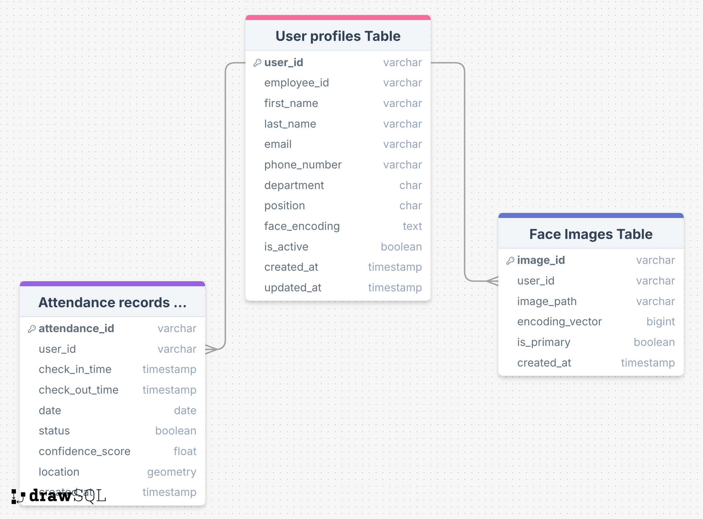

# AI-Based Face Recognition for Group Attendance Management System

This project is an AI-powered, real-time face recognition attendance system designed specifically for group environments like classrooms, workplaces, and events. Unlike traditional solutions that capture attendance one person at a time, this system is built to recognize **multiple faces in a single frame** — enabling entire groups to mark attendance **simultaneously and contactlessly**.

It prioritizes **speed, accuracy, and privacy** by using advanced computer vision algorithms, local facial encoding storage, and an intuitive web interface. The solution is built entirely on **open-source technologies** and **standard hardware**, making it highly scalable and cost-effective for commercial deployment.

---

##  Key Outcomes

-  **Simultaneous Group Processing**: Detect and recognize up to **20 faces at once** from a live webcam feed.
-  **Real-time Attendance**: Process and record attendance **within 3–5 seconds**.
-  **Privacy-Focused Design**: All facial encodings are **stored locally**, ensuring user data is not exposed to external servers.
-  **Cost-Effective Stack**: Built using open-source libraries like `face_recognition`, OpenCV, Flask, and PostgreSQL — **no paid tools or premium hardware required**.
-  **User-Friendly Dashboard**: Clean, responsive interface for admins to monitor attendance, add users, and view reports with ease.

---

##  Features

-  Real-time webcam video capture
-  Face recognition using deep learning (OpenCV + dlib)
-  Automatic attendance recording and storage
-  Cloud-ready, modular architecture
-  Web-based user interface (HTML + CSS)
-  Admin dashboard with login/logout flow
-  Secure API endpoints for backend operations

---

##  Tech Stack

| Layer         | Tools Used                        |
|--------------|------------------------------------|
| Frontend     | HTML, CSS, JavaScript              |
| Backend      | Python, Flask                      |
| ML Model     | Face recognition (Dlib / OpenCV)   |
| Database     | PostgreSQL                         |
| Deployment   | Localhost (Cloud-ready architecture) |

---

##  System Architecture

> This diagram shows how each component of the system interacts with the others.


---

##  UX Flow

> This diagram represents the user journey through the application, from login to logout.


---

##  Sequence Diagram

> This diagram shows the sequence of operations between different components when a user interacts with the system.


---

## ER Diagram (Database Design)

> The Entity-Relationship diagram below shows the relational structure between users, their facial images, and attendance records.



---

## Database Schema

> The following SQL schema defines the structure of the database tables used for storing users, facial encodings, and attendance logs.

- **User Profiles Table**  
  Stores employee information and face encodings.

- **Attendance Records Table**  
  Logs attendance check-in/out with confidence score and location.

- **Face Images Table**  
  Supports storage of multiple face images per user with encoding metadata.

➡ [Click here to view schema SQL file](docs/database_schema.sql)

➡ [Click here to view detailed design document](docs/database_design.md)

---

##  Setup Instructions

> To run this project locally:

1. Clone the repository:
   ```bash
   git clone https://github.com/BlackIron007/face-recognition-project.git
   cd face-recognition-project
2. Install dependencies:
   ```bash
   pip install -r requirements.txt   
3. Run the application:
   ```bash
   python run.py
4. Visit http://localhost:5000 in your browser.   

