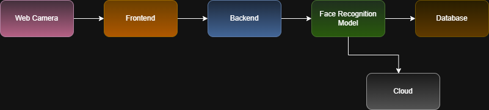
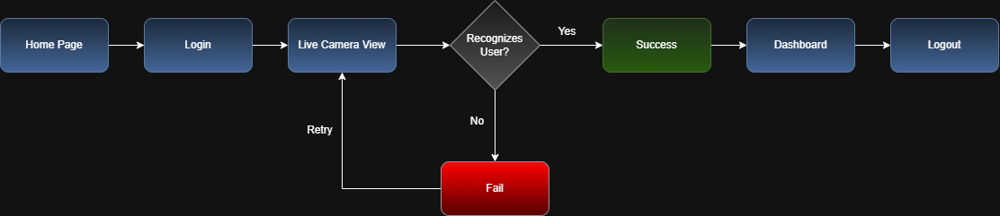
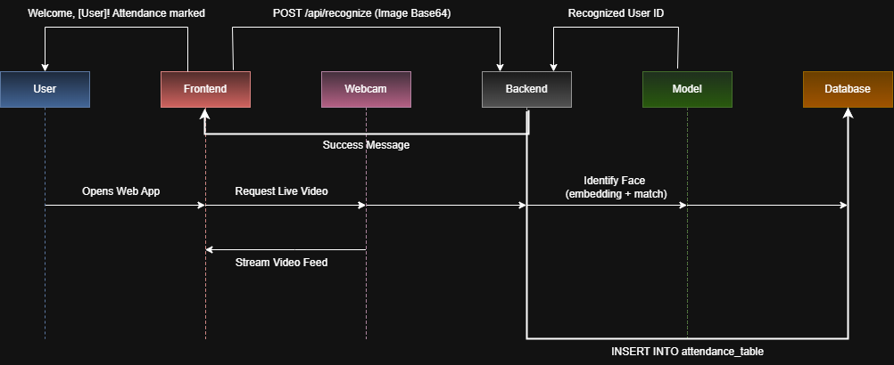

# AI-Based Face Recognition for Group Attendance Management System

This project is a smart, AI-powered attendance system that uses facial recognition to automatically mark attendance of users in real-time via webcam. Designed for classrooms, workplaces, or group gatherings, it streamlines the manual attendance process into a fast, contactless, and accurate system.

---

##  Features

-  Real-time webcam video capture
-  Face recognition using machine learning models
-  Attendance data auto-stored in a database
-  Cloud-ready architecture for scalability
-  Web-based user interface (HTML + CSS)
-  Dashboard and login/logout flow
-  Secure backend with API endpoint for recognition

---

##  Tech Stack

| Layer         | Tools Used                        |
|--------------|------------------------------------|
| Frontend     | HTML, CSS, JavaScript              |
| Backend      | Python, Flask                      |
| ML Model     | Face recognition (Dlib / OpenCV)   |
| Database     | PostgreSQL                         |
| Deployment   | Localhost (Cloud-ready architecture) |

---

##  System Architecture

> This diagram shows how each component of the system interacts with the others.



---

##  UX Flow

> This diagram represents the user journey through the application, from login to logout.



---

##  Sequence Diagram

> This diagram shows the sequence of operations between different components when a user interacts with the system.



---

##  Setup Instructions

> To run this project locally:

1. Clone the repository:
   ```bash
   git clone https://github.com/BlackIron007/face-recognition-project.git
   cd face-recognition-project
2. Install dependencies:
   ```bash
   pip install -r requirements.txt   
3. Run the application:
   ```bash
   python run.py
4. Visit http://localhost:5000 in your browser.   

